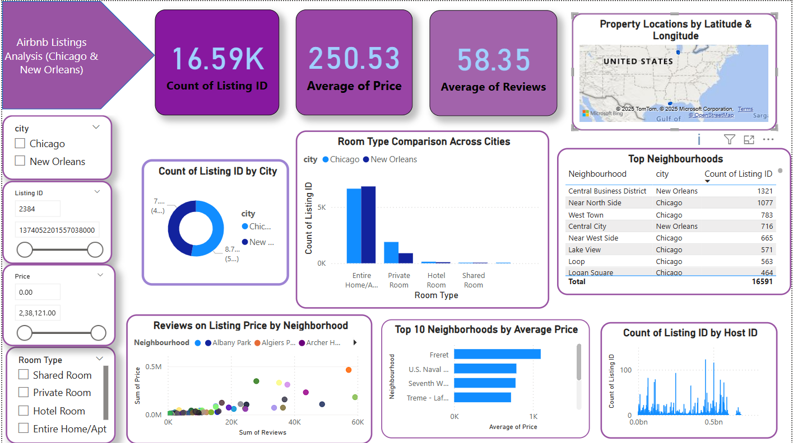

# 🏡 Airbnb Dashboard Analysis (Chicago & New Orleans)

📊 A Power BI dashboard analyzing Airbnb listings in **Chicago** and **New Orleans**.  
This project explores property types, pricing trends, host activity, and neighborhood-level insights for both cities.

---

## 🔍 Project Highlights

- Total Airbnb Listings
- Average Prices & Reviews
- Distribution of Room Types and Property Types
- Neighborhood-wise Price Comparison
- Host Performance Insights
- City-level Comparison with Filters

---

## 📁 Files Included

| File Name                          | Description                                         |
|-----------------------------------|-----------------------------------------------------|
| `Airbnb_Chicago_NewOrleans.pbix`  | Final Power BI Dashboard                           |
| `listings.csv`                    | Combined and cleaned listings data                 |
| `listings (1).csv`                | Additional cleaned data file (if needed)           |
| `dashboard.png.png`              | Dashboard screenshot preview                       |
| `README.md`                       | This project documentation                         |

---

## 🧰 Tools & Technologies

- Microsoft Power BI (Data Modeling + Visualization)
- Power Query Editor (for Data Cleaning)
- [Inside Airbnb Dataset](http://insideairbnb.com/get-the-data.html)

---

## 🗺️ Dashboard Sections

### 1️⃣ Overview
- Cards: Total Listings, Average Price, Average Reviews
- Donut Chart: Number of Listings by City
- Map View: Property locations by Latitude & Longitude

### 2️⃣ Property Analysis
- Bar Chart: Listings by Property Type
- Stacked Chart: Room Types per City
- Table: Top Neighborhoods with Most Listings

### 3️⃣ Pricing Analysis
- Histogram: Price Distribution per City
- Bar Chart: Avg. Price per Neighborhood
- Scatter Plot: Price vs Number of Reviews

### 4️⃣ Host Insights
- Bar Chart: Top Hosts by Listings
- Pie Chart: Listings by City
- Slicers for city, room type, property type, neighborhood

---

## 🖼️ Dashboard Preview

---

## 🚀 How to Use

1. **Clone or Download** this repository
2. Open `Airbnb_Chicago_NewOrleans.pbix` in Power BI Desktop
3. Ensure all CSV files are available in the same directory
4. Explore the interactive dashboard & gain insights!

---

## 🙋‍♀️ Author

**Sulthana Sufiya**  
💼 BCA Graduate | Power BI & Python Enthusiast  
📫 [Connect on LinkedIn](https://www.linkedin.com/in/YOUR_LINKEDIN_ID)

---

## ⭐ If you find this project insightful, feel free to ⭐ star the repo and share it with others!

